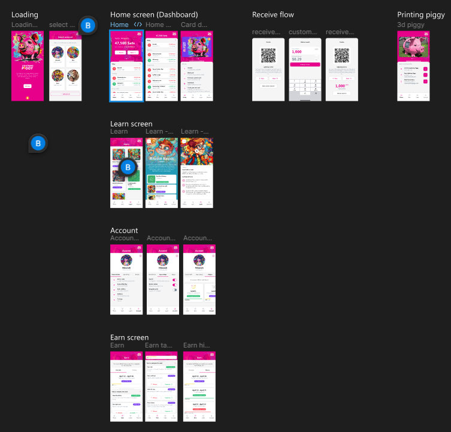

# lightning-piggy-mobile

## Description

This project is a PWA React application that uses Material-UI for its component library.

[](https://www.figma.com/proto/ROutnkBQtGGGzqi8yz0Maf/Lightning-Piggy?node-id=1-26&m=dev&scaling=scale-down&page-id=0%3A1&starting-point-node-id=19%3A519&show-proto-sidebar=1&t=P3MkR2W1YVSwtmIQ-1)

To see the Figma designs, please see:

https://www.figma.com/proto/ROutnkBQtGGGzqi8yz0Maf/Lightning-Piggy?node-id=1-26&m=dev&scaling=scale-down&page-id=0%3A1&starting-point-node-id=19%3A519&show-proto-sidebar=1&t=P3MkR2W1YVSwtmIQ-1

## Installation

To install the project, follow these steps:

1. Clone the repository: `git clone https://github.com/BenGWeeks/lightning-piggy-mobile`
2. Navigate to the project directory: `cd lightning-piggy-pwa`
3. Install the dependencies: `npm install`

## Usage

To run the project, use the command: `npm start`

## Environment Variables

This project uses environment variables for configuration. Create a `.env` file in the root of the project as follows:

```
cp .env.development .env.local
```

Modify the variables as needed to link to your own LNBits development server.

## Contributing

Pull requests are welcome. For major changes, please open an issue first to discuss what you would like to change.

## License

Do what the fuck you like.
