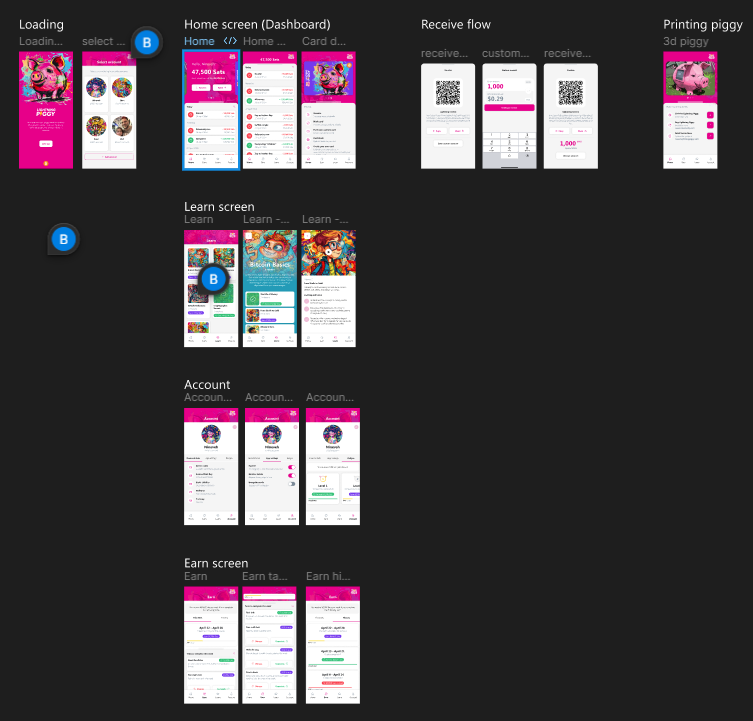

```
██╗     ██╗ ██████╗ ██╗  ██╗████████╗███╗   ██╗██╗███╗   ██╗ ██████╗
██║     ██║██╔════╝ ██║  ██║╚══██╔══╝████╗  ██║██║████╗  ██║██╔════╝
██║     ██║██║  ███╗███████║   ██║   ██╔██╗ ██║██║██╔██╗ ██║██║  ███╗
██║     ██║██║   ██║██╔══██║   ██║   ██║╚██╗██║██║██║╚██╗██║██║   ██║
███████╗██║╚██████╔╝██║  ██║   ██║   ██║ ╚████║██║██║ ╚████║╚██████╔╝
╚══════╝╚═╝ ╚═════╝ ╚═╝  ╚═╝   ╚═╝   ╚═╝  ╚═══╝╚═╝╚═╝  ╚═══╝ ╚═════╝

██████╗ ██╗ ██████╗  ██████╗ ██╗   ██╗    ███╗   ███╗ ██████╗ ██████╗ ██╗██╗     ███████╗
██╔══██╗██║██╔════╝ ██╔════╝ ╚██╗ ██╔╝    ████╗ ████║██╔═══██╗██╔══██╗██║██║     ██╔════╝
██████╔╝██║██║  ███╗██║  ███╗ ╚████╔╝     ██╔████╔██║██║   ██║██████╔╝██║██║     █████╗
██╔═══╝ ██║██║   ██║██║   ██║  ╚██╔╝      ██║╚██╔╝██║██║   ██║██╔══██╗██║██║     ██╔══╝
██║     ██║╚██████╔╝╚██████╔╝   ██║       ██║ ╚═╝ ██║╚██████╔╝██████╔╝██║███████╗███████╗
╚═╝     ╚═╝ ╚═════╝  ╚═════╝    ╚═╝       ╚═╝     ╚═╝ ╚═════╝ ╚═════╝ ╚═╝╚══════╝╚══════╝
```

A mobile Bitcoin Lightning wallet built with Expo/React Native, connecting via Nostr Wallet Connect (NWC).

[](https://www.figma.com/proto/ROutnkBQtGGGzqi8yz0Maf/Lightning-Piggy?node-id=1-26&m=dev&scaling=scale-down&page-id=0%3A1&starting-point-node-id=19%3A519&show-proto-sidebar=1&t=P3MkR2W1YVSwtmIQ-1)

## Features

- Connect any Lightning wallet via NWC (Nostr Wallet Connect)
- Send payments by scanning QR codes or pasting invoices
- Send to lightning addresses (user@domain) via LNURL-pay
- Receive payments with QR code generation
- Real-time balance display with fiat conversion
- Transaction history
- Secure credential storage (expo-secure-store)

## Getting Started

### Prerequisites

- [Node.js](https://nodejs.org/) (v18+)
- [Expo CLI](https://docs.expo.dev/get-started/installation/)
- An Android device or emulator
- A Lightning wallet that supports NWC (e.g. Alby, LNbits)

### Installation

```bash
git clone https://github.com/BenGWeeks/lightning-piggy-mobile
cd lightning-piggy-mobile
npm install
```

### Development

```bash
# Start the Expo dev server
npx expo start

# Press 'a' to open on a connected Android device
```

### Building an APK

```bash
# Generate the native Android project
npx expo prebuild --platform android

# Build the APK
cd android && ./gradlew assembleRelease

# Install on connected device
adb install app/build/outputs/apk/release/app-release.apk
```

### EAS Build (cloud)

```bash
npm install -g eas-cli
eas login
eas build --platform android --profile preview
```

## Project Structure

```
src/
  components/       # Reusable UI components (ReceiveSheet, SendSheet, etc.)
  contexts/         # React contexts (WalletContext)
  navigation/       # React Navigation setup
  screens/          # App screens (Home, Earn, Learn, Settings)
  services/         # Business logic (NWC, LNURL, fiat conversion)
  styles/           # Theme and shared styles
assets/             # Images and icons
plugins/            # Expo config plugins
```

## Figma Designs

https://www.figma.com/proto/ROutnkBQtGGGzqi8yz0Maf/Lightning-Piggy?node-id=1-26&m=dev&scaling=scale-down&page-id=0%3A1&starting-point-node-id=19%3A519&show-proto-sidebar=1&t=P3MkR2W1YVSwtmIQ-1

## Contributing

Pull requests are welcome. For major changes, please open an issue first to discuss what you would like to change.

## License

[WTFPL](http://www.wtfpl.net/)
